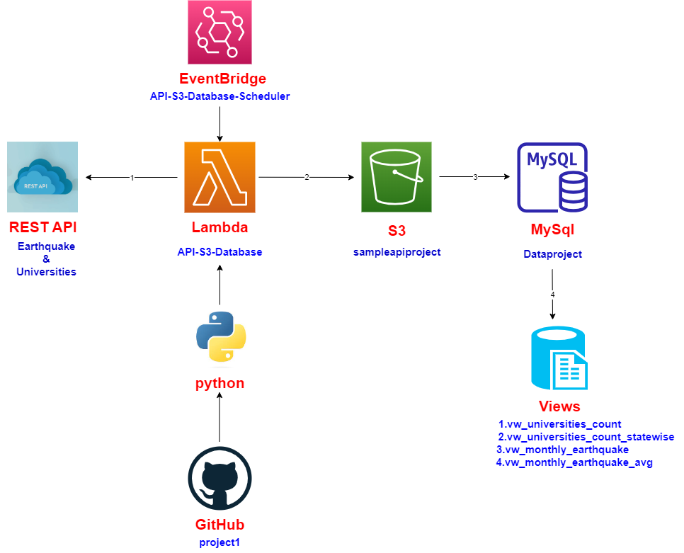

# Earthquake,Universities

## Project Description
 This project is to create reports on earthquake and universities data as views. In this project the source of data are REST APIs and loading data into mysql database hosted on AWS RDS. Pulling earthquakes data incrementally by passing startdate,enddate and magnitude, Universities data as a full load by passing Country name. In this project fetching 5 countries(India,China,Nepal,Pakistan) universities data.

 ## Following are the reports created 
 1. Number of universities in each Country.
 2. Number of universities In each state country wise.
 3. Number of earthquakes happend per  month in a year.
 4. Average magnitude per month in a year.

## Data Flow

### Description
 This project is start with getting responses from earthquake and universities RESTAPI then covert that response in  a json file for create csv file in S3 bucket. Move data from csv file to staging tables. By using stored procedure moving data from staging to main tables.Loading earthquakes data Incrementally and universities data as full load. Created multiple views based on main tables data.  

### Diagram

## Techinal Stack
1. REST API
2. AWS CLI
3. AWS SAM CLI
4. Docker 
5. WSL2
6. VS code
7. Python 3.9
8. AWS Lambda
9. AWS Lambda Layers
10. AWS S3
11. AWS RDS
12. Mysql
13. SQL
14. AWS IAM
  
     